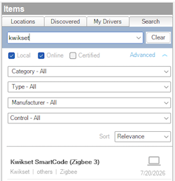

<!-- Copyright 2026 Finite Labs, LLC. All rights reserved. -->

______________________________________________________________________

# Overview

> DISCLAIMER: This software is neither affiliated with nor endorsed by Control4,
> Kwikset, or the Zigbee Alliance.

The Kwikset SmartCode (Zigbee 3) driver brings Kwikset SmartCode deadbolts and
levers into Control4 as a standard lock. It speaks Zigbee 3.0 ZCL DoorLock
directly to the lock, so it works with any Kwikset SmartCode joined to the
controller's Zigbee 3.0 network - no hub, bridge, or cloud required. Lock,
unlock, toggle, user codes, auto-lock, and event history are all managed from
the standard Control4 lock interface.

# Index

- [System Requirements](#system-requirements)
- [Features](#features)
- [Compatibility](#compatibility)
- [Installer Setup](#installer-setup)
  - [Driver Installation](#driver-installation)
  - [Joining the Lock](#joining-the-lock)
  - [Driver Setup](#driver-setup)
    - [Driver Properties](#driver-properties)
    - [Managing the Lock](#managing-the-lock)
    - [Driver Actions](#driver-actions)
  - [Connections](#connections)
- [Programming](#programming)
  - [Events](#events)
- [Support](#support)
- [Changelog](#changelog)

# System Requirements

- Control4 OS 4.2.0 or later
- A controller running the **Zigbee 3.0** stack with an open network
- A Kwikset SmartCode deadbolt or lever with a **Zigbee 3.0** radio (see
  [Compatibility](#compatibility))

# Features

- Standard Control4 lock control: lock, unlock, and toggle from Navigators and
  programming
- Speaks Zigbee 3.0 ZCL DoorLock directly to the lock - no hub, bridge, or cloud
- Manual, keypad, and key operation reflected back as the lock's status
- User code management for up to 30 users, each with an optional schedule
- Administrator code, auto-lock interval, and history size configured from the
  lock interface
- Event history of lock, unlock, and user-code changes
- Battery level reporting, with a low-battery event for programming
- Locked, Unlocked, Jammed, and Battery Low events for programming

# Compatibility

Works with Kwikset SmartCode deadbolts and levers that use a **Zigbee 3.0** (HA
1.2 ZCL DoorLock) radio, including models converted with a Zigbee SmartCode
module. Verified model families:

| Model                     | Type           |
| ------------------------- | -------------- |
| SmartCode 5               | Deadbolt       |
| SmartCode 5               | Lever          |
| SmartCode 10              | Deadbolt       |
| SmartCode 10T Touchscreen | Deadbolt       |
| SmartCode Convert         | Conversion kit |

Other Kwikset SmartCode models with a Zigbee 3.0 radio are expected to work. If
you have a model that is not listed, please
[open an issue](https://github.com/finitelabs/control4-zigbee3-kwikset/issues/new)
so it can be added.

# Installer Setup

## Driver Installation

Driver installation and setup are similar to most other drivers. Below is an
outline of the basic steps for your convenience.

1. Download the latest `control4-zigbee3-kwikset.zip` from
   [GitHub](https://github.com/finitelabs/control4-zigbee3-kwikset/releases/latest).
1. Extract and
   [install](https://www.control4.com/help/c4/software/cpro/dealer-composer-help/content/composerpro_userguide/adding_drivers_manually.htm)
   the `.c4z` file.
1. Use the "Search" tab to find the "Kwikset SmartCode (Zigbee 3)" driver and
   add one to your project for each lock you intend to join.
    
1. Continue to [Joining the Lock](#joining-the-lock).

## Joining the Lock

Add one **Kwikset SmartCode (Zigbee 3)** driver per lock, then join each lock to
the controller's Zigbee 3.0 network:

1. Confirm the controller is running the **Zigbee 3.0** stack with an open
   network.
1. Select the driver and open its **Identify** page.
1. Put the lock into Zigbee pairing mode (see the lock's manual, usually a
   factory reset or a dedicated pairing step on the keypad).
1. Wait for the lock to join. Its status, battery, and user codes populate once
   it reports in.

> Locks are battery powered and sleep to save power. If the lock does not
> respond immediately after a command, operate the keypad once to wake it and
> the status will reconcile.

## Driver Setup

### Driver Properties

#### Cloud Settings

##### Automatic Updates \[ Off | **_On_** \]

Enables or disables automatic driver updates from GitHub releases.

##### Update Channel \[ **_Production_** | Prerelease \]

Sets the update channel used when checking for automatic updates from GitHub
releases.

#### Driver Settings

##### Driver Status (read-only)

Displays the current state of the driver - for example _Online_ or _Offline_.

##### Driver Version (read-only)

Displays the current version of the driver.

##### Firmware Version (read-only)

Displays the firmware version reported by the lock.

##### Log Level \[ 0 - Fatal | 1 - Error | 2 - Warning | **_3 - Info_** | 4 - Debug | 5 - Trace | 6 - Ultra \]

Sets the logging level. Default is `3 - Info`.

##### Log Mode \[ **_Off_** | Print | Log | Print and Log \]

Sets the logging mode. Default is `Off`.

### Managing the Lock

User codes, schedules, and lock settings are managed through Control4's standard
lock interface (the **Locks** agent and the lock's device page), not from the
driver's Properties tab:

- **User Codes** - add, edit, and remove up to 30 user codes. Each user can be
  given an optional schedule that restricts when the code is active.
- **Administrator Code** - the master code used for privileged operations.
- **Auto Lock** - the delay before the lock relocks itself, selectable from
  `OFF`, `15 sec`, `30 sec`, `1 min`, `2 min`, `3 min`, `5 min`, `10 min`,
  `20 min`, and `30 min`.
- **History Size** - the number of history entries retained (`5`, `10`, `20`, or
  `50`).
- **History** - a log of recent lock, unlock, and user-code changes, each with a
  timestamp and source.

### Driver Actions

#### Lock

Locks the lock.

#### Unlock

Unlocks the lock.

#### Toggle

Locks the lock if it is unlocked, and unlocks it if it is locked.

#### Sync Users

Re-sends every stored user code to the lock. Use this if the lock was reset or
you suspect its codes are out of sync with the project.

#### Get Battery Status

Requests the lock's current battery level and updates the `Battery Status`
property.

#### Update Drivers

Triggers the driver to update from the latest release on GitHub, regardless of
the current version.

## Connections

### Lock (provider)

The Control4 lock proxy connection. It is managed by the driver and provides the
lock functionality to Control4.

### ZIGBEE (consumer)

The Zigbee 3.0 network connection to the controller. It is bound automatically
when the lock is joined.

# Programming

## Events

| Event       | Description                                 |
| ----------- | ------------------------------------------- |
| Locked      | Fires when the lock is locked               |
| Unlocked    | Fires when the lock is unlocked             |
| Jammed      | Fires when the lock fails to lock or unlock |
| Battery Low | Fires when the lock reports a low battery   |

# Support

If you have any questions, supported-device requests, or issues to report, you
can file an issue on GitHub:

https://github.com/finitelabs/control4-zigbee3-kwikset/issues/new

# Changelog

<!--
Template for a new release entry (copy below the heading, fill in, uncomment):

## v[Version] - YYYY-MM-DD

### Added
- Added

### Fixed
- Fixed

### Changed
- Changed

### Removed
- Removed
-->

## Unreleased
